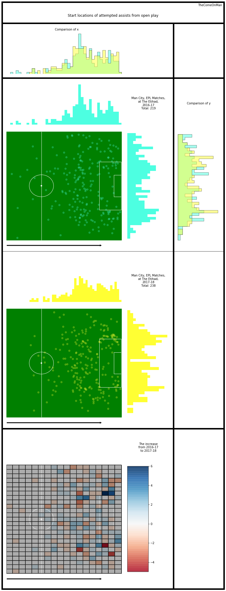
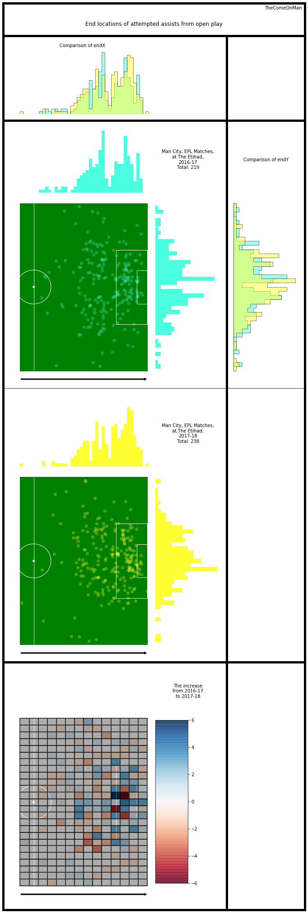
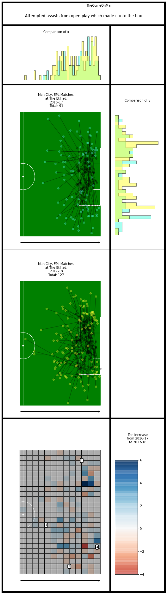
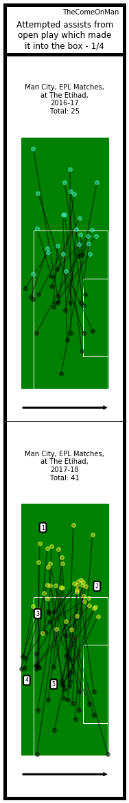
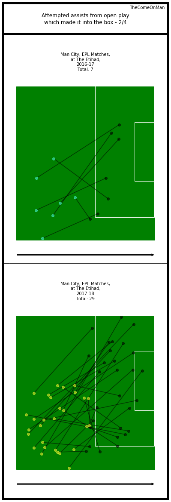
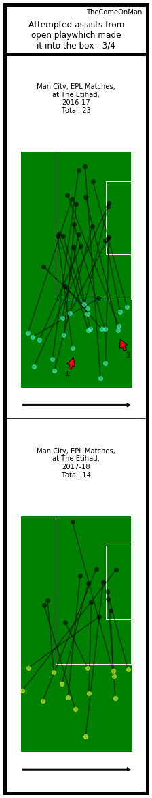
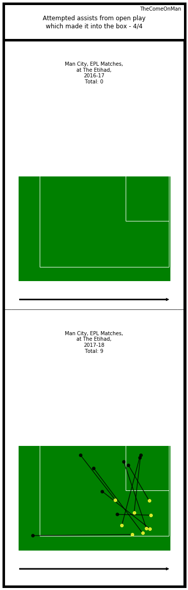
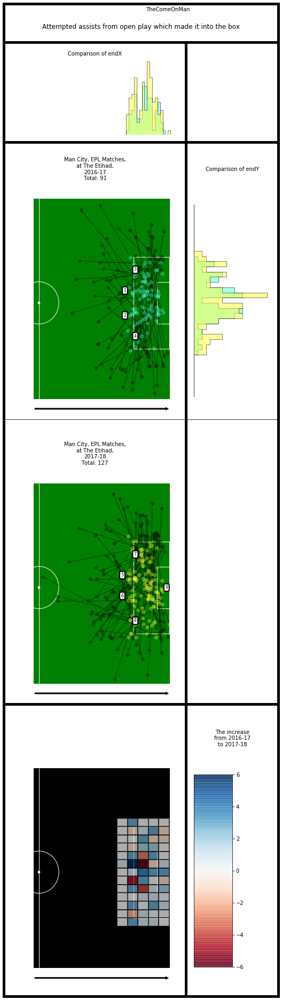
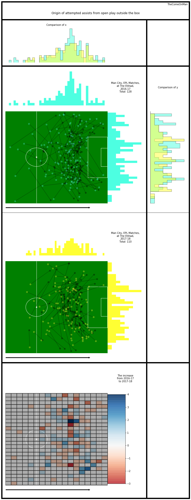
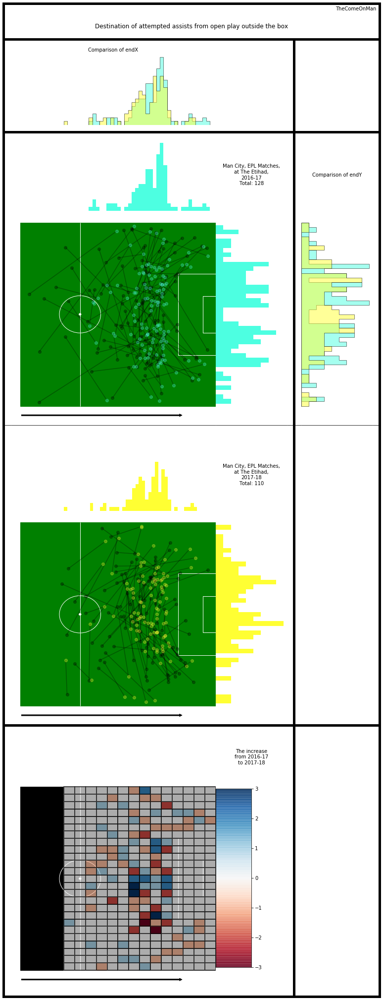

# Assists

## Glossary

* Horizontal - the direction from the defending goal to the attacking goal
* Vertical - the direction perpendicular to the horizontal direction, from the right to the left side of the pitch
* Thirds - The pitch is roughly divided into one thirds, along the horizontal direction. The final third is where the attacking
goal is.
* x - Increases along the horiztonal, goes from 0 to 100 from defense to attack
* y - increases along the vertical, goes from 0 to 100 from the right to the left of the pitch
* angles - Are in radians. 360 degrees ~ 6.28 radians. 0 or 6.28 radians are in the horizontal direction, along an increase in x. 1.47 radians is along the vertical, pointing towards the left.

## Anti-Glossary

* I think the end location of an unsuccessful pass marks the location of the interception or the block / steal. I don't have player locations so it's unlikely that we can guess where and whom the pass was intended for.
* The pass length is probably in metres. The unit doesn't really matter since we're only comparing but still.

## Introduction

This looks at attempted assists from open play in isolation and doesn't get to the stage of connecting passes to get an understanding of the how the play progressed, etc. That will be a little more intensive and complex and will be attempted later. 

I only look at data from their home matches because the same pitch size will probably allow a more consistent narrative to emerge. Worst case, we will explain only half of the changes and will need to repeat this for games that they played at other stadiums.

Observations:
- The increase in attempted assists isn't as drastic as the increase in goals scored.
- Assists originated from areas closer to the goal in 17-18. On both dimensions, assists are originating from areas closer to the goal. Assists from deeper towards the wings reduced. More assists from just outside the box, in front of the goal increase.
- The edge of the middle third is a high contributor in both seasons.
- The final third is a far higher contirbutor in 2017-18. In 2016-17, there's a belt around the edge of the box which is a low activity area which is utilised more in 2017-18.
- In 2017-18, there are these blobs around the corner of the box which don't contribute as many assists as the surrounding areas.
- In 2017-18, on the right of the pitch, there were a multiple instances of assists attempted from deep in the midfield. There is then a gap on the pitch after which assists were attempted again. In comparison, 2016-17 has a more symmetric spread.

Observations:
- Assists ended in areas closer to the goal in 17-18. On both dimensions, assists are originating from areas closer to the goal. The expectation in 2016-17 was for the expected goal scorer to carry the ball far more than what the excpectation was in 2017-18 maybe?
- In 2016-17, There were very few assists received farther on the right side, inside the box. 2017-18 still has higher occurrence on the left but the right isn't left out as much.
- 2016-17 again seems to have two parts of the pitch into which assists were aimed, one just at the edge of the final third, and one deep into the final third.
- 2016-17 feels like a very well bifurcated regime. There are almost no assists aimed in the vertically central part of the pitch outside the box and even in the box there seems to be a clear set of assists aimed towards the left and a set aimed towards the right. 2017-18 doesn't seem as rigidly divided.

## Assists Into The Box

### Origin of Attempted Assist

I have marked out four areas of interest so let's zoom into those.

Observations:
- Except for a few odd points, there seem to be two areas primarily, area 1 and 2, where assists were attempted from, and areas 3, 4, and 5 are typically the destinations. From this area, assists were typically attempted along these 2 X 3 = 6 channels.
- Areas 1 and 2 have some distinction in 2017-18 in terms of the exact location on the pitch and the end destination of assists attempted. They seem a little mixed in 2016-17.
- In 2016-17, area 3 seems to be a little mixed up with areas 4 and 5 and none of the areas seem as well defined as in 2017-18.

Observations:
- Diagonal balls into the box, likely to runners running from the left side of the pitch, were attempted in far higher numbers 2017-18.

Observations:
- While there were generally fewer attempts in 2017-18, notably there was only one assist attempted from deep on the right.

Speculation:
- 2016-17 seems to have two sets of passes, one set along arrow 1, and one set along arrow 2. Possible that the strategy is for the player to always pass along that angle and it's the recipient's responsibility to get on the end of it?

Observations:
- Like area 2 in part 1, towards the left of the box, there are some assists being attempted from a similar area on the right also in 2017-18. 2016-17 has no such assists being attempted.

### Destination of Attempted Assist

Observations:
- In 2017-18, areas 5 and 6 are popular end locations of assists just at the edge of the box, and area 9 stretches all the way across the edge of the 6 yard box. In 2016-17, area 9 seems to be broken into two parts which stretch all the way to areas 1 and 2, and there is very little activity in the centre of the pitch. That's the two patches which showed higher activity in 2016-17 than in 2017-18.
- Area 4, in 2016-17, shows very little activity, as compared to area 8 which shows a little more activity in 2017-18.
- Areas 3 and 7 are close but not exactly the same.

## Assists Outside The Box

Not giving this as much importance as assists inside the box because shooting from distance is usually a distant plan B for a side like City.

Observations:
- 2016-17 seems to have two distinct blobs on the left and the right of the pitch. 2017-18 seems a little more consistently spread out in front of the box esp with some assists aimed in vertical centre of the pich.
- There are very few assists aimed in the right corner of the pitch in 2017-18 as compared to 2016-17.
