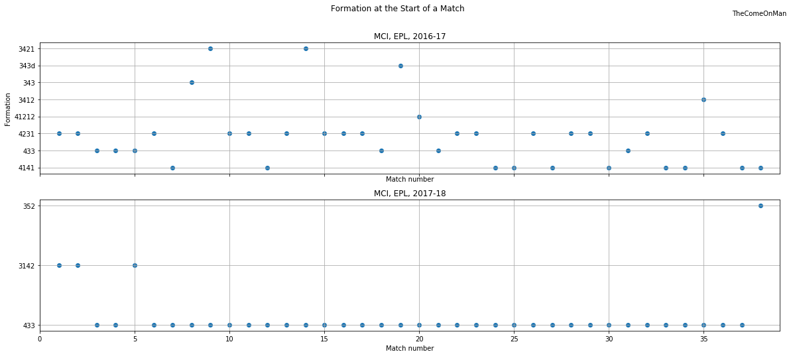

# Formations

## Introduction

This analyses the sort of formation Manchester City deployed through the season. A formation can be considered the simplest indicator of what the team strategy is. It isn't a comprehensive reflection of the strategy by any means but it is a good start.

### What is a Formation?

It's an indicator of how players typically position thmselves on the field. For eg. a 4-3-3 means 4 players as defenders staying towards the back of the pitch, 3 players as midfielders playing around the middle of the pitch, and 3 players as forwards playing towards front of the pitch. Similarly, a 4-2-3-1 has 4 defenders, 2 midfielders who stay towards the back, 3 midfielders who stay towards the front, and 1 forward.

## Analysis

### Time Spent in Various Formations

We'll look at the proportion of time that a particular formation was employed for during the season.

A total of 40 + 43 = 83% of time in 2017-18 was spent playing in a 4-3-3 whereas 2016-17 is a lot more spread out with a lot of 4-3-2-1 away and a lot of 4-1-4-1 at home. There is a good amount of time spent in 4-3-3 in 2016-17 also but it's a much smaller share than the other two formations.

PS: The data says there are -2 minutes of 5-3-2 in 2017-18 from their away game against Bournemouth. We aren't particularly interested in exact numbers and are only interested in broad trends. We'll assume such errors are small in magnitude and few in number and carry on.

### Starting Formations

A better indicator of a team's plan A is probably the formation they started the match with.

In 2017-18, 34 matches started with a 4-3-3 and only 4 started in some other formation. The split between 4-1-4-1, 4-2-3-1, and 4-3-3 in 2016-17 is evident again.

There is no strong preference for one formation through 2016-17. 4-2-3-1 seems to be the choice at the start of the season, with three matches in which MCI started with a 4-3-3. 4-1-4-1 begins to make regular appearances in the last few matches.

In 2017-18, interestingly, the plan at the start of the season seems to be to play a 3-1-4-2 but that soon changes to a 4-3-3 which then remains in place till the end of the season. 

### Change in Formations

Let's also look at formation changes during matches.

Note how after the 12th match of 2017-18, there are barely any formation changes. 2016-17 has pretty frequent changes for most of the season except for the last 12 matches or so.

## Speculation

Was the 4-1-4-1 towards the end of 2016-17 a reactive measure to 4-2-3-1 not working the way Guardiola expected?

All the formation changes in 2016-17 are a refleciton of Guardiola trying to figure out his best formation? And get good results?

The 3-1-4-2 at the start of 2017-18 was because 3 at the back was in fashion after Chelsea's title win the previous year? Or to fit Aguero and Jesus?

Mendy got injured roughly around the same time that the 4-3-3 switch in 2017-18 happened. Was it a blessing in disguise? Or was that the plan anyway?

4-3-3 is what Guardiola used to play at Barcelona as well. 2017-18 is just him going back to something he was comfortable with?
