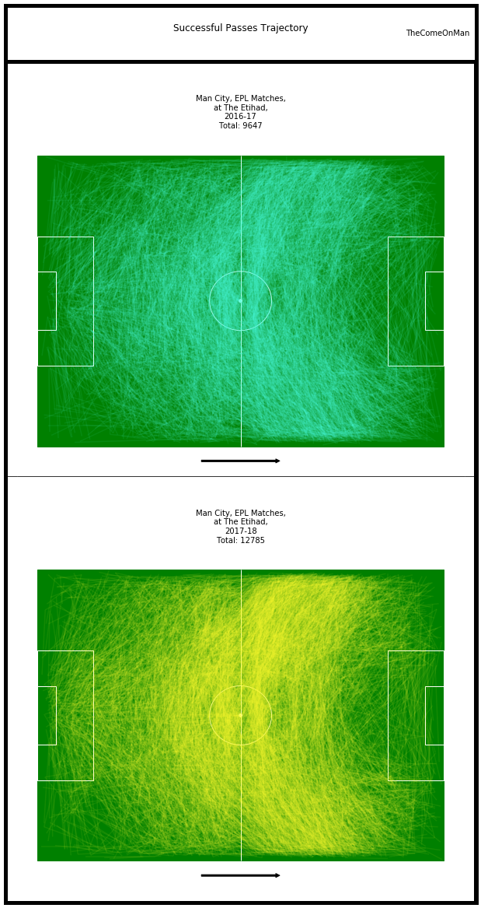
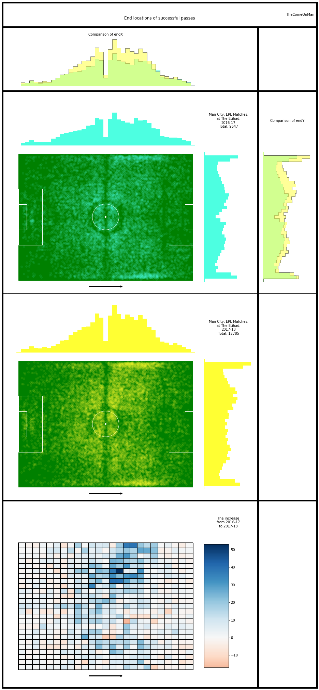
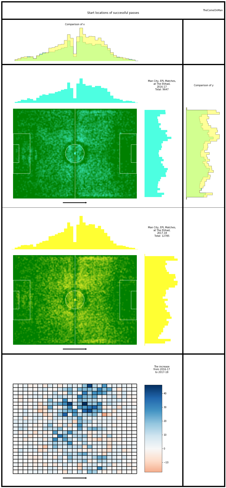
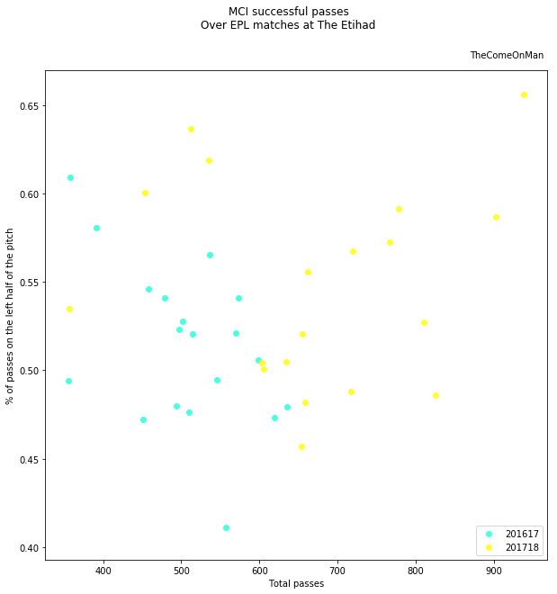
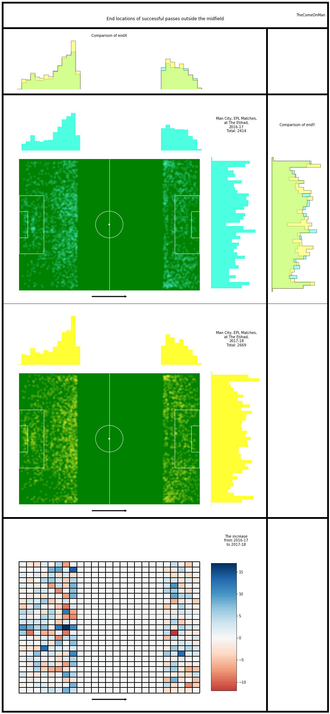
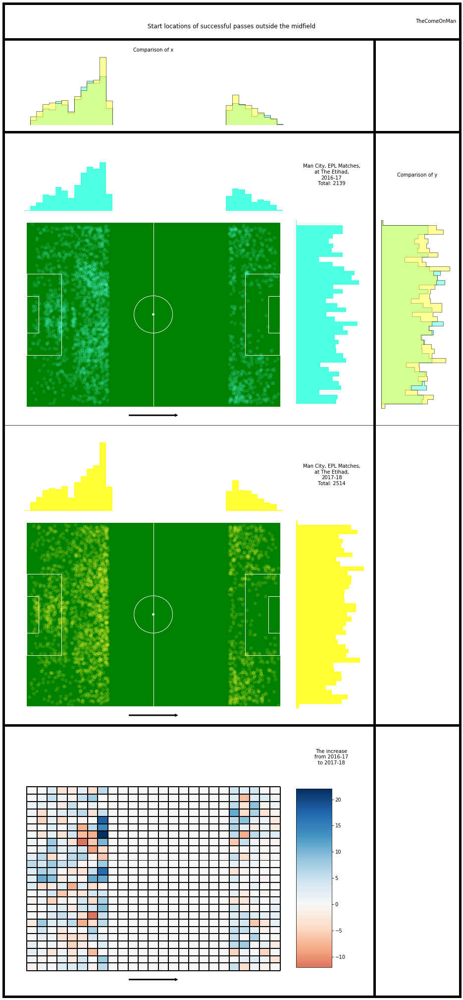

# Passing - 1

## Glossary

* Horizontal - the direction from the defending goal to the attacking goal
* Vertical - the direction perpendicular to the horizontal direction, from the right to the left side of the pitch
* Thirds - The pitch is roughly divided into one thirds, along the horizontal direction. The final third is where the attacking
goal is.
* x - Increases along the horiztonal, goes from 0 to 100 from defense to attack
* y - increases along the vertical, goes from 0 to 100 from the right to the left of the pitch
* angles - Are in radians. 360 degrees ~ 6.28 radians. 0 or 6.28 radians are in the horizontal direction, along an increase in x. 1.47 radians is along the vertical, pointing towards the left.

## Anti-Glossary

* I think the end location of an unsuccessful pass marks the location of the interception or the block / steal. I don't have player locations so it's unlikely that we can guess where and whom the pass was intended for.
* The pass length is probably in metres. The unit doesn't really matter since we're only comparing but still.

## Introduction

This looks at passes in isolation and doesn't get to the stage of connecting passes to get an understanding of the how the play progressed, etc. That will be a little more intensive and complex and will be attempted later. 

I only look at data from their home matches because the same pitch size will probably allow a more consistent narrative to emerge. Worst case, we will explain only half of the changes and will need to repeat this for games that they played at other stadiums.

The passing analysis is broken down into chunks to make it easier on the eye. This is part 1. I'll look at the open play successful passes together and look for overall trends.

## Analysis

### Successful Passes 

First we'll just plot all the successful passes over a season.

Observations:

- Between 2016-17 and 2017-18, Manchester City's successful pass count rose from 9647 to 12785, which is almost 33% of the total successful passes in 2016-17.
- The higher density of passes in the arc around the midfield is visually evident.

Let's break this down into where the passes started and where the passes ended.

Some structure to the passing emerges in these scatter plots:
- There are lanes to the left and the right wing
- There are four blocks around the centre circle
- There are the four spots in each quadrant of the centre circle
- Very few passes end on the centre line or the circumference of the centre circle
- If you look a little hard you can make out a lack of passes along the outline of the boxes as well. The boxes I've drawn are probably a little smaller than the actual boxes.

Observations:

* Most of the increase in passes seem to have come from passes being received in the middle third of the pitch with the left side contributing more than the right. Note the groups of blocks with a very high increase on the left of midfield.
* The region spanning the significant increase in passes is spread over a much bigger area on the left than the right.
* The rest of the pitch is a mixed bag with much smaller increases or decreases.
* There seems to have been an aversion to passing in the narrow lane around the vertical cente in 2016-17 which isn't present in 2017-18. There seems to be a slightly higher number of passes being received in this strip in the first two thirds of the pitch in 2017-18.

Observations:
- The changes in the locations of the origin of passes has a very similar pattern as the change in the locations of the passes being received. It's likely that most of the extra passes are short passes.

Let's check if this trend is consistent across matches.

There are quite a few matches in 2017-18 in which passes on the left side othe pitch accounted for more than 55% of the passes but almost a similar number of matches also have passes on the left accounting for between 45% to 55%. The higher passing on the left wasn't some sort of strategy in all the matches then.

2016-17 doesn't have as many matches with such a high proportion of passes on the left and also the number of passes is much lesser so similar percents don't add up to as high a number.

### Successful Passes Outside the Midfield

Let's also remove the visually dominating midfield area and see if there is anything of interesting happening towards the ends of the pitch. 

Observations:
- The higher passing around the vertical centre appears more clearly here in the defensive third.
- It's a little hard to say visually whether it's a decrease or if the increase isn't as much, but the corners of the pitch show lesser activity in 2017-18.

Observations:

- The tendency to go to the left starts early on the in the pitch itself maybe? Even the goalkeeper's territory has more activity towards the left.
- The corners relatively show a lower activity for the start of passes also.
