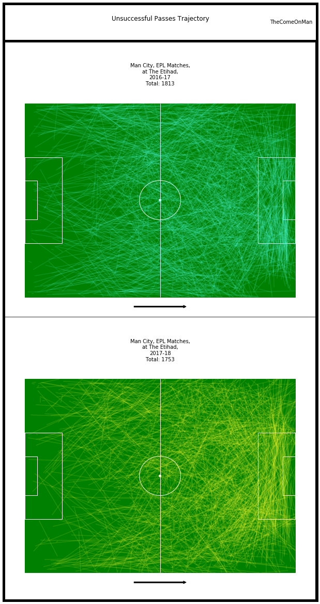
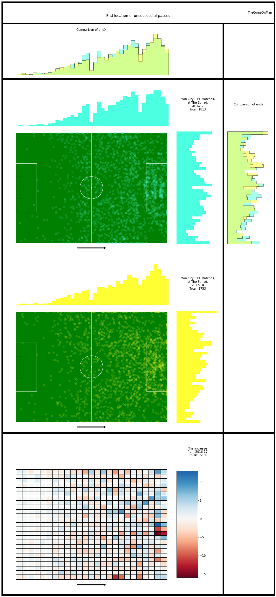
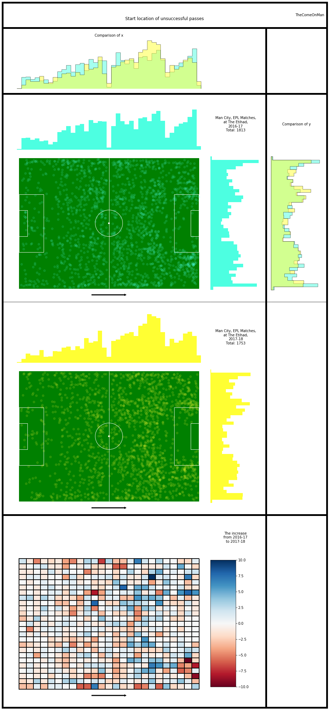

# Passing - 2

## Glossary

* Horizontal - the direction from the defending goal to the attacking goal
* Vertical - the direction perpendicular to the horizontal direction, from the right to the left side of the pitch
* Thirds - The pitch is roughly divided into one thirds, along the horizontal direction. The final third is where the attacking
goal is.
* x - Increases along the horiztonal, goes from 0 to 100 from defense to attack
* y - increases along the vertical, goes from 0 to 100 from the right to the left of the pitch
* angles - Are in radians. 360 degrees ~ 6.28 radians. 0 or 6.28 radians are in the horizontal direction, along an increase in x. 1.47 radians is along the vertical, pointing towards the left.

## Anti-Glossary

* I think the end location of an unsuccessful pass marks the location of the interception or the block / steal. I don't have player locations so it's unlikely that we can guess where and whom the pass was intended for.
* The pass length is probably in metres. The unit doesn't really matter since we're only comparing but still.

## Introduction

This looks at passes in isolation and doesn't get to the stage of connecting passes to get an understanding of the how the play progressed, etc. That will be a little more intensive and complex and will be attempted later. 

I only look at data from their home matches because the same pitch size will probably allow a more consistent narrative to emerge. Worst case, we will explain only half of the changes and will need to repeat this for games that they played at other stadiums.

The passing analysis is broken down into chunks to make it easier on the eye. This is part 2. I'll look at open play unsuccessful passes together and look for overall trends.

## Analysis

### Unsuccessful Passes

Similar to how we looked at the successful passes, let's also look at the unsuccessful passes and see if there is anything to be found.

Observations:
* While the successful passes went up by 33% between the two seasons, the unsuccesful ones slightly reduced.
* There seems to be a drop in unsuccesful passes in the defensive and middle third. The proportion of dropped passes seems to be a lot higher in the final third in 2017-18.

Observations:
* In 2016-17, there is a slightly higher occurrence of unsuccessful passes in the middle third and the edge of the final third.
* In 2017-18, there is a higher occurrence of unsuccessful passes in the final third, especially towards the left side. The increased occurrence on the left side might just be a correlation with the much higher passing on the left?
* There is a set of blocks towards the right, just in front of goal, where unsuccessful pass occurrence significantly dropped.

Observations:
* In 2016-17, there is a higher occurrence of unsuccessful passes being initiated in the defensive half and near the centre of the pitch.
* In 2017-18, there is a higher occurrence of unsuccessful passes being initiated at the edge of the final third, especially towards the left side, which might again be a correlation with the increased passing on the left side.
* There is an isolated block towards the right, towards the corner, where unsuccessful pass occurrence significantly dropped.
