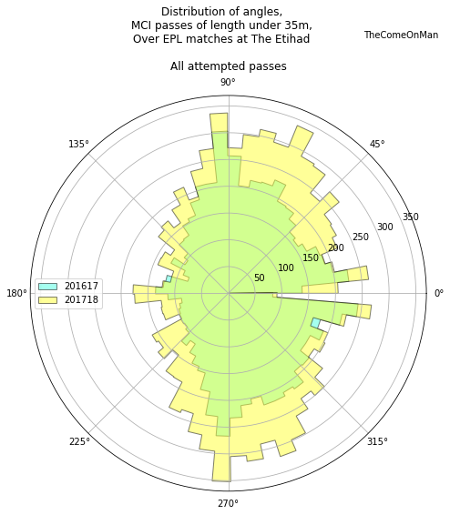
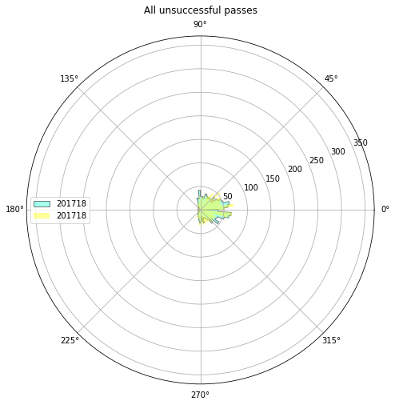

# Passing - 3

## Glossary

* Horizontal - the direction from the defending goal to the attacking goal
* Vertical - the direction perpendicular to the horizontal direction, from the right to the left side of the pitch
* Thirds - The pitch is roughly divided into one thirds, along the horizontal direction. The final third is where the attacking
goal is.
* x - Increases along the horiztonal, goes from 0 to 100 from defense to attack
* y - increases along the vertical, goes from 0 to 100 from the right to the left of the pitch
* angles - Are in radians. 360 degrees ~ 6.28 radians. 0 or 6.28 radians are in the horizontal direction, along an increase in x. 1.47 radians is along the vertical, pointing towards the left.

## Anti-Glossary

* I think the end location of an unsuccessful pass marks the location of the interception or the block / steal. I don't have player locations so it's unlikely that we can guess where and whom the pass was intended for.
* The pass length is probably in metres. The unit doesn't really matter since we're only comparing but still.

## Introduction

This looks at passes in isolation and doesn't get to the stage of connecting passes to get an understanding of the how the play progressed, etc. That will be a little more intensive and complex and will be attempted later. 

I only look at data from their home matches because the same pitch size will probably allow a more consistent narrative to emerge. Worst case, we will explain only half of the changes and will need to repeat this for games that they played at other stadiums.

The passing analysis is broken down into chunks to make it easier on the eye. This is part 3. I'll look at open play pass lengths and angles.

## Analysis

### Pass Lengths

I split the histogram at 35m because the occurrence of passes shorter than 35m was dwaring that of longer than 35m and made it hard to observe the  lower occurrence of passes longer than 35m in 2017-18.

### Long passes

    Total passes longer than 35m in 2016-17: 665
    Total successful passes longer than 35m in 2016-17: 343
    Total passes longer than 35m in 2017-18: 582
    Total successful passes longer than 35m in 2017-18: 339

Observations:
- In 2017-18, you can notice a drastic reduction in long passes in the forward direction, the ones at an angle between 315 and 45 degrees. These passes were also very often unsuccessful in 2016-17. 
- Sideward long passes, the ones around 90 or 270 degrees are retained and long passes towards the left of the pitch are actually much higher in 2017-18.

Observations:
- In 2017-18, the defensive half has lower long passes being initiated. The goalkeeping area, and the wings stand out.
- In 2017-18, there is a large pocket to the right of midfield which has a higher incident of long passes being initiated. Is that related to the slightly higher long passes we see between 45 to 90 degrees?

Observations:
- In 2017-18, a lot more of the long passes ended in the defensive half.
- There is a noticeable switch in the number of long passes aimed to the left wing and the right wing near the edge of the final third.

Observations:
- Almost the entirety of reduction in long passes in 2017-18 seems to come from the drop in unsuccessful passes being initiated from the defensive half.

Observations:
- Long passes getting intercepted earlier on in the pitch in 2016-17 is evident.
- More long passes got intercepted in the top left corner in 2017-18. Are these the passes being aimed there from the right of midfield?

### Short passes

    Total passes shorter than 35m in 2016-17: 10755
    Total successful passes shorter than 35m in 2016-17: 9264
    Total passes shorter than 35m in 2017-18: 13922
    Total successful passes shorter than 35m in 2017-18: 12412

The bulk of the passes are shorter than 35m passes so we see the same patterns as what we were seeing in the overall passes in part 1.

Observations:
- There is one big patch, or maybe two small ones, towards the left of the final third where there are many more short unsuccessful passes in 2017-18.
- There is a path to the right of the final third as well where there are many more short unsuccessful passes in 2017-18.
- There is one patch on the right of the final third where there are many more short unsuccessful passes in 2016-17.

Observations:
- There is a patch right in front of goal where there are significantly lower occurrence of unsuccessful passes in 2017-18.
- It isn't very clear but it's possible that in the attacking third, 2016-17 had more of the unsuccessful passes out on the wing while 2017-18 had more of them near the centre of the pitch and around the goal.
