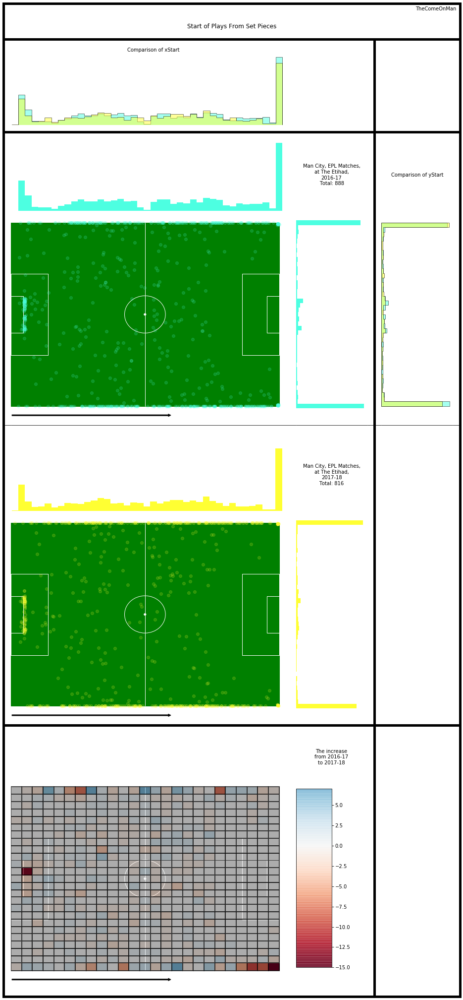
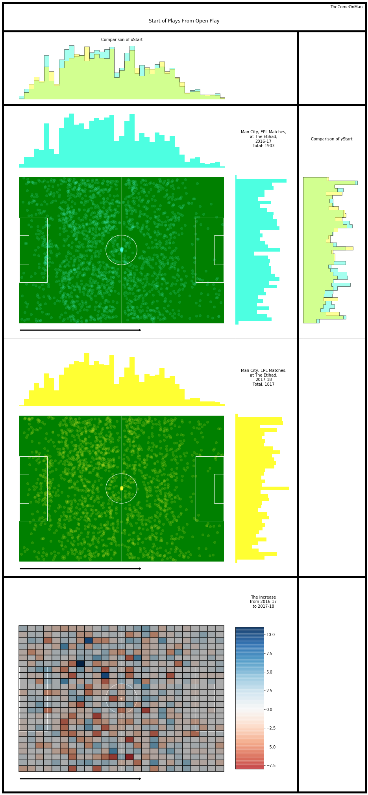
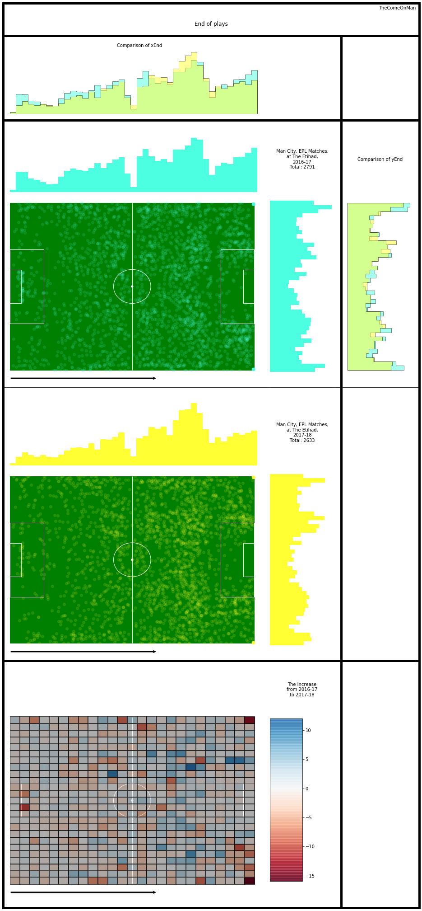
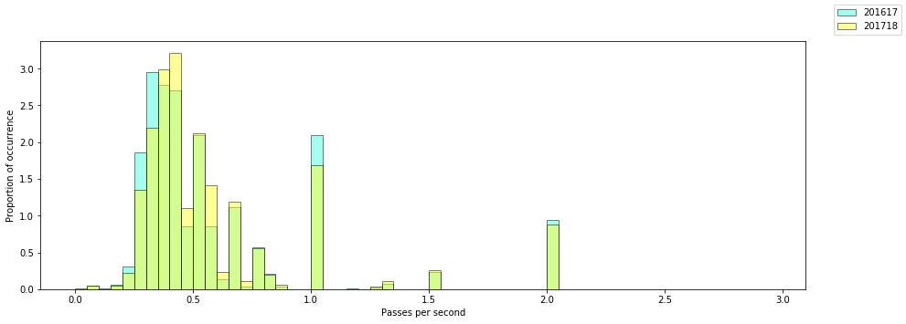
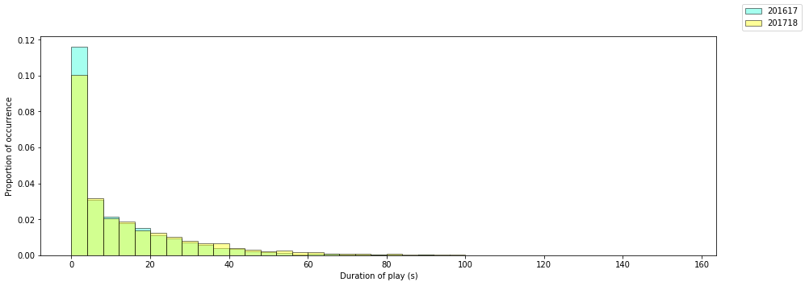
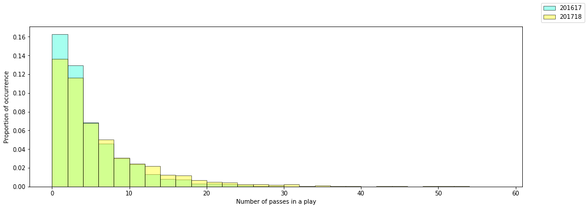
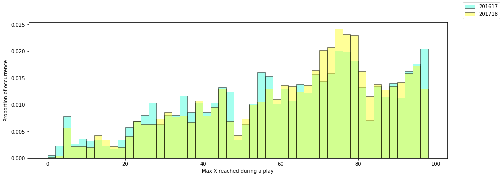

# Plays - 1

## Glossary

* Horizontal - the direction from the defending goal to the attacking goal
* Vertical - the direction perpendicular to the horizontal direction, from the right to the left side of the pitch
* Thirds - The pitch is roughly divided into one thirds, along the horizontal direction. The final third is where the attacking
goal is.
* x - Increases along the horiztonal, goes from 0 to 100 from defense to attack
* y - increases along the vertical, goes from 0 to 100 from the right to the left of the pitch
* angles - Are in radians. 360 degrees ~ 6.28 radians. 0 or 6.28 radians are in the horizontal direction, along an increase in x. 1.47 radians is along the vertical, pointing towards the left.
* xEnd, yEnd - for a play defined as the initiation coordinates of the last attempted pass

## Anti-Glossary

* I think the end location of an unsuccessful pass marks the location of the interception or the block / steal. I don't have player locations so it's unlikely that we can guess where and whom the pass was intended for.
* The pass length is probably in metres. The unit doesn't really matter since we're only comparing but still.

## Introduction

Beginning the analysis of how their plays progressed.

I only look at data from their home matches because the same pitch size will probably allow a more consistent narrative to emerge. Worst case, we will explain only half of the changes and will need to repeat this for games that they played at other stadiums.

The passing analysis is broken down into chunks to make it easier on the eye. This is part 1. I'll look at the open play successful passes together and look for overall trends.

## Analysis

### Start of plays 

Observations:
- There is a slight drop from 2016-17 and most of the drop seems to come from the right corner of the pitch or possibly goal kicks.

( I don't know what kick offs are marked by yet. Will clear it out once I figure it out. Overall trends shouldn't change much though. )

Observations:
- There is a slight drop from 2016-17 and most of the drop seems to come from the defensive half of the pitch and the right side of the pitch.

### End of Plays

Observations:
- The area just in front of the opposition box had a much higher share of plays ending in 17-18. Most other areas of the pitch show reduced activity.
- The right corner of the pitch again seems to have a significantly higher activity in 2016-17 just like the start of play. This might be worth investigating some more.
- The left edge of the box has a marked increase in 2017-18.

### Style of Play

The data only has second level resolution so any play which started and ended within the same second shows a duration of zero. I have excluded plays which started and finished in the same second because most of them seem to be one pass plays producing an artifically large spike at 1. The spikes at 1, 1,5, etc. are because of the lack of resolution.

The observations below try to take into account that the spike are misleading.

Observations:
- There is a higher occurrence of plays in 2016-17 at around the 0.25 passes per second mark which seems to be shifted a bit to the left in 2017-18. Passing speed may have slightly increased by about 0.1 to 0.2 passes per second in 2017-18. 

Observations:
- There are far more instances of really short duration plays in 2016-17. Most of these are plays of 0 to 1 seconds ( which is not charted out separately )
- After the 20 second mark, there tend to generally be more 2017-18 plays than 2016-17. 

Observations:
- Similar to what we observed for play duration, the number of passes in a play also seem to have more 2016-17 plays for plays of 5 or lesser passes and plays in 2017-18 were more often of longer than 5 passes.

Observations:
- Similar to what we observed for play ending location, the farthest forward that plays reached uring a play also seems to be outside the opposition box far more often in 2017-18.
- The higher 2016-17 share near the end of the pitch occurs here as well. 
- As observed in the passing metrics, in 2016-17 a higher share of plays ended much earlier in the pitch.
