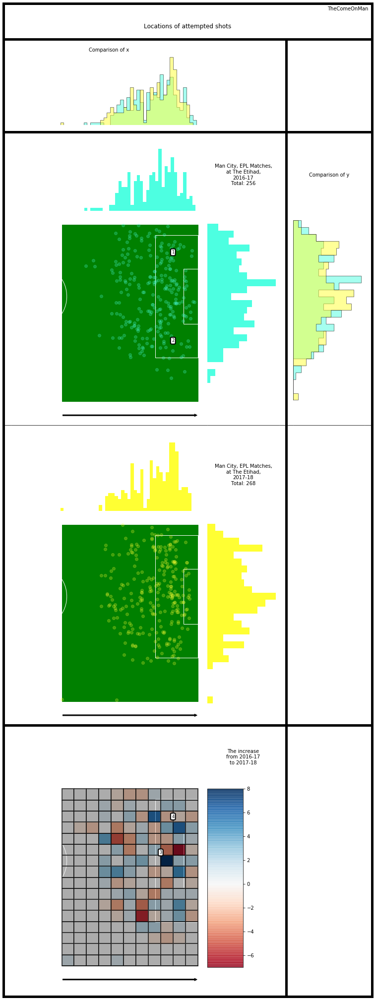
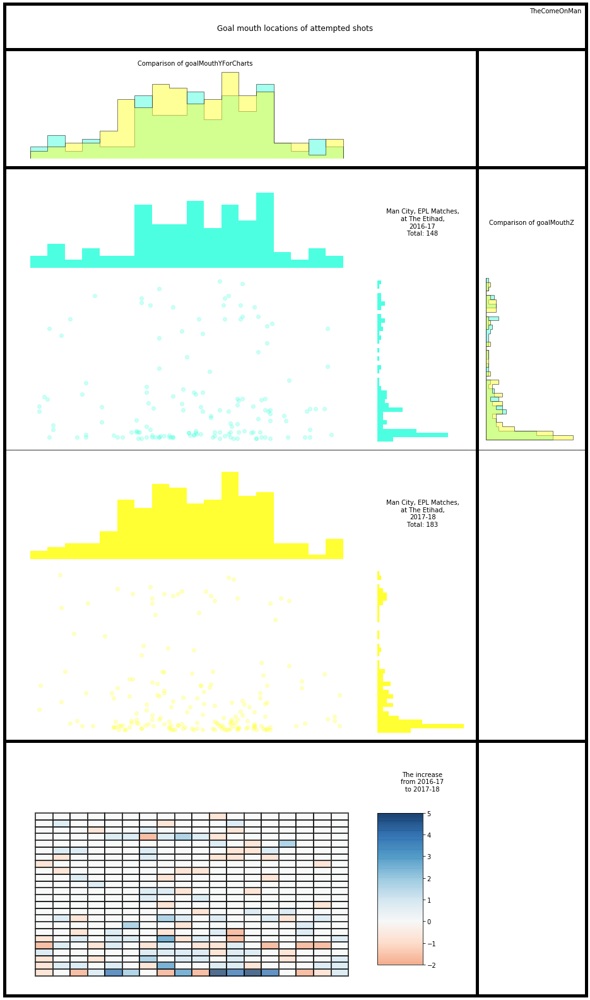

# Shots

## Glossary

* Horizontal - the direction from the defending goal to the attacking goal
* Vertical - the direction perpendicular to the horizontal direction, from the right to the left side of the pitch
* Thirds - The pitch is roughly divided into one thirds, along the horizontal direction. The final third is where the attacking
goal is.
* x - Increases along the horiztonal, goes from 0 to 100 from defense to attack
* y - increases along the vertical, goes from 0 to 100 from the right to the left of the pitch
* angles - Are in radians. 360 degrees ~ 6.28 radians. 0 or 6.28 radians are in the horizontal direction, along an increase in x. 1.47 radians is along the vertical, pointing towards the left.

## Introduction

This looks at shots in isolation and doesn't get to the stage of connecting passes to get an understanding of the how the play progressed, etc. That will be a little more intensive and complex and will be attempted later. 

I only look at data from their home matches because the same pitch size will probably allow a more consistent narrative to emerge. Worst case, we will explain only half of the changes and will need to repeat this for games that they played at other stadiums.

Observations:
- The shots attempted from open play increased almost by a third.
- Most areas of the pitch record higher shots attempted in 2017-18.
- Areas 1 and 2 have very few shots originaing in 2016-17 but more in 2017-18.
- There is a sharp increase in shots taken from the area marked 3 and 4. This correlates with areas we saw more assists targeted towards.
- There seems to be a bias towards shooting from the left side of the six yard box in both seasons.

I'm still figuring out where the goal mouth starts and end in the coordinates so the below is major work in progress. My guess is the goal mouth lies somewhere just around the bits where goalMouthY histogram spikes.

Some data is also randomly missing from the goal mouth coordinates. We'll assume it doesn't alter the inferences significantly.

Observations:
- In both years, there are a really high number of shots near the botton of the goal.
- In 2017-18, there is a marked increase in attempts all across left side of the goal.
- In 2017-18, the right side shows a strong increase towards the bottom of the goal but the rest of goal mouth is mixed.
- There is also an increase in the attempt near the bottom of the goal.
